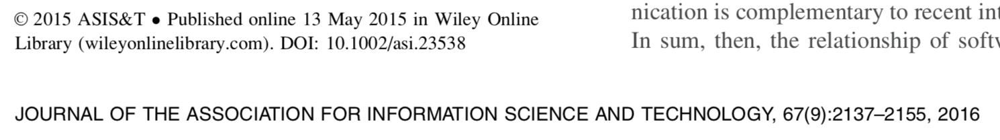
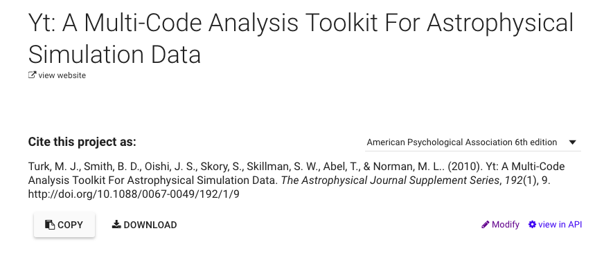
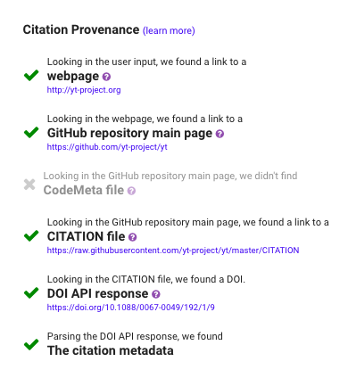
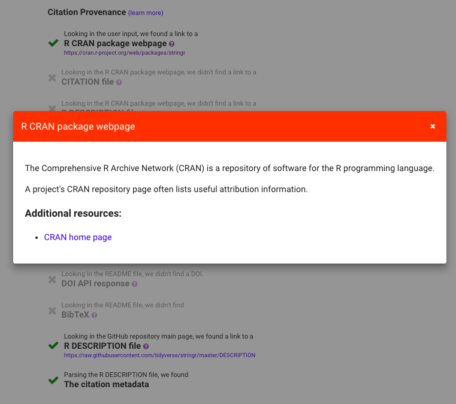

```{r, setup, include=FALSE, echo=F, results='hide', message=FALSE, warning=FALSE}
knitr::opts_chunk$set(cache=TRUE)
```


## SoftCite goals and activities

Our grant proposal lays out the goals of the SoftCite project:

> Our goal is to improve software in scholarship (science, engineering, and the humanities) by raising the visibility of software work as a contribution in the literature, thus improving incentives for software work in scholarship.

Our major activites are:

1. Develop a "Gold Standard" manually coded dataset of software mentions in the literature
2. Use that standard toward machine learning discovery of software mentions
3. Develop a database linking software tools to associated citations
4. Using this database, prototype and study three tools: CiteAs, CiteSuggest, and Software ImpactStory

In this report we describe Year 2 progress in each of these activities and discuss future plans.

## Progress on "Gold Standard" dataset development

This year we moved from our reported 151 articles in October 2017 to complete coding on 4,548 articles, moving from 523 mentions of software to 5,684 mentions. Our content analysis progress can be seen in this screenshot from our dashboard (developed by henryrossiter and mrcyndns, part of our undergraduate content analysis team). 


En route we have trained 37 content analysis research assistants, including undergraduates (from UT Austin and Houston Tillotson University), masters students from the Information School, and two female doctoral students (Hannah Cohoon and Caifan Du) who have managed the content analysis.

Our content analysis has been across three datasets: pubmed open access, economics (open access via unpaywall), and astronomy (open access via unpaywall). We were able to leverage the Impact Story work on unpaywall to create random samples of open access articles in econ and astro, once we recognized that unpaywall already included the sources we had identified in our proposal.  We considered that software was very unlikely to be mentioned in a systematically different way between closed and open-access published papers.

The dataset is publically available on [https://github.com/howisonlab/softcite-dataset](https://github.com/howisonlab/softcite-dataset), including in a more accessible CSV format (the as-coded dataset is in RDF format).

Expenditure on hourly coding has come to \$70,000 of direct costs, for a dataset of 4,548 coded articles or a cost of just over \$15 per article. Hourly coders were paid \$15 an hour. While articles vary greatly in length, a mean rate of one article an hour seems about right, as fixed costs of infrastructure management and coder training are amortized.

# Software mention recognizer (Machine Learning)

The project has welcomed Patrice Lopez as an expert in automated analysis of scientific literature [https://scholar.google.com/citations?user=xDfUqfcAAAAJ&hl=en](https://scholar.google.com/citations?user=xDfUqfcAAAAJ&hl=en).  Patrice is employed through Impact Story. Patrice is the ideal person to pursue this work, including expertise in converting PDFs to text in a useful way and in training entity recognition.  He has previously worked on extracting measures (pressure, time, and other quantities).

The goal of this component is to recognize in textual documents and in PDF any mentions of softwares with associated attribute information such as number version, author, url or version date.   

## Progress towards recognizer infrastructure

The recognition of software mentions is an information extraction task similar to NER (Named Entity Recognition). It is implemented as a sequence labelling problem, where the labels applied to sequence of _words_ (named _tokens_ in this context), with indications of attachment for the attribute information (_version number_, _url_, etc.) to the appropriate software name mention. 

The software component is implemented as a Java sub-module of the Open Source tool [GROBID](https://github.com/kermitt2/grobid) to take advantage of the functionalities of GROBID for parsing and automatically structuring PDF, in particular scholar PDF. Patrice Lopez is one of the authors of the GROBID system. This approach has several advantages:

- It is possible to apply the software mention recognizer only to relevant structures of the PDF article, ignoring for instance bibliographical sections, figures, formulas, affiliations, page number breaks, etc., with correct reading order, dehyphenized text, and correctly re-composed UTF-8 character. This is what we call __structure-aware document annotation__.

- We can reuse existing training, feature generation and evaluation functionalities of GROBID for Linear CRF (Conditional Random Field), leading to a very fast working implementation with one of the best Machine Learning model for sequence labelling.

- All the processing pipeline is integrated in a single service, which eases maintenance, deployment, portability and reliability.

- As a GROBID module, the recognizer will be able to scale very well with a production-level robustness. This scaling ability is crutial for us because our objective to process around 10 millions scholar Open Access PDF, an amount which is usually out of reach of research prototypes. GROBID was already used to process more than 10 millions PDF by different users (ResearchGate, INIST-CNRS, Internet Archive, ...). 

For reference, the two other existing similar Open Source tools, [CERMINE](https://github.com/CeON/CERMINE) and [Science-Parse](https://github.com/allenai/science-parse), are 5 to 10 times slower than GROBID on single thread and requires 3 to 4 times more memory, while providing in average lower accuracy (Tkaczyk and al. 2018, Lipinski and al. 2013) and more limited structures for the document body (actually ScienceParse v1 and v2 do not address this aspect). 

We used a similar approach for recognizing [astronomical objects](https://github.com/kermitt2/grobid-astro) and [physical quantities](https://github.com/kermitt2/grobid-quantities) in scientific literatures with satisfactory accuracy (between 80. and 90. f-score) and the ability to scale to several PDF per second on a multi-core machine.

Prior to using the entity recognition toolchain, the data are first compiled with actual PDF content to generate XML annotated documents (MUC conference style) which are the actual input of the training process. These annotated documents will be ideal for publishing the dataset for use by the wider  machine learning community.

## Service and demo

The software mention component offers a REST API consuming text or PDF and delivering results in JSON format (see the [documentation](https://github.com/Impactstory/software-mentions#grobid-software-mentions-module)). 

http://software.science-miner.com is a first demo of the recognizer. It illustrates the ability of the tool to annotate both text and PDF, and is already available online. This is excellent progress, providing the infrastructure to exploit improvements in the underlying system and dataset.


In the case of PDF, the service allows the client to exploit the coordinates of the mentions in the PDF for displaying interactive annotations directly on top the PDF layout. 


The text mining process is thus not limited to populating a database, but also offers the possibility to come back to users and show them in context the mentions of softwares. 
 
## Preliminary results

We present below the current metrics of the software mention model, as produced by the software component. The annotated corpus is divided randomly with 90% for training and 10% for evaluation. We use traditional precision, recall and f1 scores. Token-level evaluation indicates how good the labeling is for each token. Field-level evaluation indicates accuracy for a complete multi-word sequence, including correct attachment of attributes (`creator`, `url`, `version-date`, `version-number`) to the correct `software`.


```
===== Token-level results =====

label                precision    recall       f1     

<creator>            58.8         60.35        59.57  
<software>           77.67        51.39        61.86  
<url>                66.67        93.62        77.88  
<version-date>       100          22.22        36.36  
<version-number>     85.53        69.52        76.7   

all fields           74.73        60.77        67.03   (micro average)

===== Field-level results =====

label                precision    recall       f1     

<creator>            61.64        52.33        56.6   
<software>           73.43        48.25        58.24  
<url>                60           75           66.67  
<version-date>       100          22.22        36.36  
<version-number>     71.74        60           65.35  

all fields           70.71        51.15        59.36   (micro average)
```

Note that we present here simply intermediary results, and final evaluation metrics will be averaged over 10 random annotated corpus segmentations or via a 10-fold approach to match good practice. 

## Deep learning model

We developed a Keras deep learning framework called [DeLFT](https://github.com/kermitt2/delft) (**De**ep **L**earning **F**ramework for **T**ext) for text processing, covering in particular sequence labelling as used in GROBID. This library re-implements the most recent state-of-the-art Deep Learning architectures. 
It re-implements in particular the current state of the art model (BiLSTM-CRF with ELMo embeddings) for NER (Peters and al. 2018), with even [slightly improved performance](http://science-miner.com/a-reproducibility-study-on-neural-ner/) on the reference evaluation dataset CoNLL NER 2003.

The training data of GROBID is supported by DeLFT and, as a consequence, any GROBID CRF models can have an equivalent Deep Learning model counterpart. 

We plan to generate different Deep Learning models for the software mention recognition and benchmark them with the CRF model. We will thus be able to report reliable evaluations for all the best current named entity recognition algorithms and select the highest performing one. The evaluation will cover accuracy, but also processing speed and memory usage, with and without GPU.  

## Next iterations

The above preliminary results are given for information and to illustrate the evaluation functionality integrated in our tool. These results should not be considered significant at this early stage:

- the training data is only partially exploited, due to alignment issues between the annotations and the PDF content, which are currently being addressed,

- the quality of the training data is currently the object of the effort of the Howison Lab. Supervised training is very sensitve to the quality of the training data, and this will automatically improve the accuracy of the model by a large margin,

- no effort at this stage have been dedicated to feature engineering, which is a key aspect of CRF. We need to wait for the improvement of the quality of the training data to address this step,

- some techniques like sub- or over-sampling can be used to optimize accuracy.

Our target is a f-score between 80-90, which would allow us to address the next step of software entity disambiguation and matching in good conditions. Another possibility is tuning the system for high recall (finding as many pieces of software) while sacrificing precision (finding many things that are not software) and using a manual process of inspection to weed out non-software mentions. A "human in the loop" approach may be appropriate for systems such as SoftCite Suggest or Software Impact Story. 

# CiteAs Update

CiteAs, as described in the previous Interim Report, has been up and running throughout the year.  We have described the system in a very recent blog entry on [the URSSI blog](http://urssi.us/blog/2018/10/01/citeas.org-discovering-and-improving-software-requests-for-citation/) (included as an appendix to this report.) In Year 2, CiteAs was enhanced with additional elements, include working with `Arxiv IDs` and `citation.cff` files.

We have also publicized CiteAs through data science oriented communities on twitter, as well as presenting it at the RSE conference in the UK (including a hackday), and the dot-Astronomy conference, at which James Howison gave invited keynotes. We are invited to the URSSI software citation workshop to further promote the tool and better understand how it fits into the ecosystem.

We have had discussions with a program officers at the NIH (National Library of Medicine), Jennifer Sticco, who are interested a "Pubmed for software".

# Plans for Year 3

The research team has reviewed progress against the initial plans outlined in the proposal.

1. Improvement of CiteAs.  ImpactStory is negotiating to hire additional developers to improve CiteAs. Intended improvements include:
  - recogizing and presenting more than one requested citation.
  - analyzing the logs as users search for wanted citations.
  - failing more gracefully, and using failing to find a request as an opportunity to educate tool-developer users about how to make better requests and tool-user users about how to create their own best practice citations.

2. Sociotechnical study of CiteAs, conducted by James Howison and Caifan Du at UT Austin.

    - Interview current and potential users and hosters.
    - Give further feedback to ImpactStory to improve the product.
    - Followup with the National Library of Medicine and seek others to hand the system off to.

3. Continued content analysis

As Patrice's work on the machine learning (described above) showed, there is an urgency to demonstrate improved agreement across the content analysis dataset.  We conducted a round of agreement early in Year 2 and demonstrated agreement on the most important codes at levels considered very good for social science content analysis. Consultation with machine learning practicioners at the time suggested that improved training and then single coding would produce the best value for money, gaining more data overall.  With the further input of Patrice and the evidence from the current machine learning results, it now appears crucial to test and improve agreement across the dataset.  Accuracy issues can be particioned into three sources: agreement in the dataset, machine learning system issues, and data sufficiency issues. As we seek to understand and improve software entity recognition, and to gain the confidence of machine learning practicioners to have them attack the system issues creatively, demonstrating improved agreement and increasing the size of the dataset seem most crucial.

Two other opportunities to improve the dataset present themselves: The first is bootstraping using a "whitelist" of software packages, identifying sentences with those words in them. We would then manually code just those sentences. Assuming that packages known beforehand (and therefore on the white list) are not mentioned in systematically different ways bootstraping can train a system to learn generally how packages are mentioned and apply that learning to find mentions of packages not on the whitelist. Colleagues have taken this approach (Pan et al, 2015) but they have not had the fully manually coded set to validate their approach; our manually coded full dataset will provide validation.

The second approach takes advantage of one finding so far: software mentions cluster together in articles. However they do not cluster predictably (e.g., one paper might have multiple clusters and clusters are not neccessarily only in methods sections). We will experiment using a whitelist to locate mentions of known packages and then expand a sliding window to increase our chance of finding mentions of packages not on the whitelist; this ought to amerliorate bias resulting from the choice of the whitelist and allow us to more reliably characterize mentions per article en rouate to a full machine learning system.

4. Continue to improve the machine learning mention recognizer, as described above.

# Conclusion: redirect some prototype funds to improve content analysis.

The proposal conceived two additional prototypes: Softcite Suggest and Software Impact Story.  Both rely on a well-functioning machine learning system to perform well. Each could be prototyped using just the manually coded data, but would not function beyond that coded set.

A Softcite Suggest prototype infrastructure could be built relatively easily, at least at the API level (drawing on the infrastructure of the recognizer described above). We have had good contacts with publishers who would be interested in this tool, including the Amercian Astronomers Society and Elsevier. 

While a prototype and sociotechnical study of Software Impact Story would be great, with the current performance of the machine learning system our underlying data would be limited to the manually coded data, reducing the usefulness of the prototype, even as a demonstration. The project team therefore believes the best course at this stage is to redirect funds intended for that development work to improvement and expansion of the content analysis work.

Accordingly we think we should re-allocate approximately \$30k of the Year 3 budget to content analysis (including experiments to speed up coding). ImpactStory would focus primarily on continued improvements to CiteAs.org, the machine learning system, and a rough prototype of Softcite Suggest. Thus we would reduce the size of the sub-contract to ImpactStory by \$30k, leaving that money at UT Austin.

This would ensure that we have the highest quality dataset for publication by the end of the grant, as well as the best performing machine learning system using it. In addition we will have an excellent prototype and sociotechnical study of CiteAs.  This focuses our effort on the highest payoff activites, but also those most likely to succeed.

# References

(Lipinski and al. 2013) [Evaluation of Header Metadata Extraction Approaches and Tools for Scientific PDF Documents](http://docear.org/papers/Evaluation_of_Header_Metadata_Extraction_Approaches_and_Tools_for_Scientific_PDF_Documents.pdf). M. Lipinski, K. Yao, C. Breitinger, J. Beel, and B. Gipp, in Proceedings of the 13th ACM/IEEE-CS Joint Conference on Digital Libraries (JCDL), Indianapolis, IN, USA, 2013. 

Pan, X., Yan, E., Wang, Q., & Hua, W. (2015). Assessing the impact of software on science: A bootstrapped learning of software entities in full-text papers. Journal of Informetrics, 9(4), 860–871. https://doi.org/10.1016/j.joi.2015.07.012

(Peters and al. 2018) Deep contextualized word representations. Matthew E. Peters, Mark Neumann, Mohit Iyyer, Matt Gardner, Christopher Clark, Kenton Lee, Luke Zettlemoyer, NAACL 2018. [arXiv:1802.05365](https://arxiv.org/abs/1802.05365)

(Tkaczyk and al. 2018) Evaluation and Comparison of Open Source Bibliographic Reference Parsers: A Business Use Case. Tkaczyk, D., Collins, A., Sheridan, P., & Beel, J., 2018. [arXiv:1802.01168](https://arxiv.org/pdf/1802.01168).


# Appendix: CiteAs Publicity

This was invited and published by Dan Katz in October 2018 at the [USRRI blog]:(http://urssi.us/blog/2018/10/01/citeas.org-discovering-and-improving-software-requests-for-citation/)

# CiteAs.org: Discovering and Improving software requests for citation

- James Howison, [University of Texas at Austin](http://james.howison.name)
- Heather Piwowar and Jason Priem, [Impact Story](https://impactstory.org)

[CiteAs.org](https://citeas.org) links between pieces of software and their requested citations. It enables moving from the name of a piece of software, its webpage URL, or a DOI, directly to the machine-readable metadata (e.g., BibTex, Zotero auto-import) for the citation the author of the software package wants you to use. CiteAs.org is funded by the Digital Science program at the Sloan Foundation (Grant Number 8028), and conceived and developed by Heather Piwowar and Jason Priem at [ImpactStory](https://impactstory.org), together with [James Howison](http://james.howison.name) from the Information School at the University of Texas at Austin.

**Great software work --> Clear requests for citation --> More visibility in publications --> More credit --> Better Software --> Better Research**

Getting credit for useful software in science is important, yet it is rarely clear how the authors of a piece of software would like to be cited. [Howison and Bullard, 2013](http://doi.org/10.1002/asi.23538) found that less than half of the times in which publications actually mentioned software were formal, traceable, citations. At least part of the reason is that software very rarely contains citation information, and even when software does, that information is certainly not as obvious as it is in a paper. With a paper, if you have the paper you have the metadata right there in front of you:



But if you have a piece of software, you very likely don't have the metadata needed to cite it. You know the name of the code, you might know the homepage of the project that creates it, but you don't know how to cite it. In part this is because with software there is no standard place to "write" the information, but the problem is compounded because authors sometimes want their users to cite something other than the piece of software directly. Examples include citing a paper that introduces the software (or demonstrated its potential), a published software manual or book, a "software paper" created specifically as a citation target, or a benchmarking paper.

Great work is being done to guide best practices (including the [FORCE11 Working Group on Software Citation](https://www.force11.org/group/software-citation-working-group)) which recommends always including a direct citation to the software itself, including version numbers---something key for reproducibility---in addition to papers. We don't disagree, but we think it's important to let the authors decide how their contribution should be acknowledged and to link users with those requests.

One approach to making this link is to create a new standard format and location to make clear requests, such as including a free text request in a [CITATION file](https://www.software.ac.uk/blog/2016-10-06-encouraging-citation-software-introducing-citation-files) or a machine readable set of requests in a [CodeMeta file](https://codemeta.github.io/) or [CITATION.cff file](https://github.com/citation-file-format/citation-file-format) file. These have the advantage of being easy to locate and read, but the disadvantage of requiring everyone to adopt a new practice before this approach can work.

We know that people already make requests for citation in a whole range of places, including requests on project web-pages that provide `bibtex` or DOIs, metadata associated with DOIs or repositories (such as Github and Gitlab), and in language specific formats (such as R's `citation()` method, which reads from a `DESCRIPTION` file).

CiteAs includes a web-scraper that seeks out requests wherever they might be, following a set of logical rules based on how we've seen people ask for a citation. We ask users to start with something they know about the software, such as the project name, a project "landing page" (e.g., [SciPy's requests for citations](https://www.scipy.org/citing.html)), or a project's repository URL. We then have plugins arranged in a sequence that obtain data from out on the web and seek the best citation request, prioritizing metadata by its imputed intentionality, such as `CITATION.cff` file, `CITATION` file, `citation()` calls, `DOAP` metadata, and metadata registered associated with a DOI (e.g., [Zenodo's software DOIs](http://about.zenodo.org/principles/)). Of medium priority is metadata discovered through natural language requests on webpages (such as `bibtex` or other formats on landing pages). Finally we fall back to creating a simple citation to a repository or even web-page.

We want to discover and honor author's requests and simultaneously educate authors about how to make clearer or more specific citation requests, encouraging them to make use of more expressive formats. We do that by showing our discovery process and highlighting missing, higher intentionality, opportunities to make requests.

## Examples

### Example 1: YT

YT is a python package for analyzing and visualizing volumetric data. Entering the YT webpage URL into the CiteAs.org search field retrieves the correct citation in a variety of different common citation formats as well as in structured data that can be imported into Zotero in one click:



Since a key goal of CiteAs is education, the **process used** to find this citation is also highlighted on the results page:



From this list we can see the steps the application took to find the citation—which both helps establish provenance and also educate users about better ways to register and discover software citation metadata.

### Example 2: Stringr

The Stringr package provides wrappers for common string operations in R. Given the URL for the package's CRAN page, CiteAs finds and displays the correct citation for this package. CiteAs takes quite a few hops to finally figure out where the canonical citation metadata is, but it does eventually find it in the R DESCRIPTION file. Again, the display of all these steps helps users understand more about the possible approaches to software citation. The (?) icon next to each step links users to additional documentation.



## Challenges and next steps

### Locating requests

Eventually we plan to incorporate an additional source: the manner in which packages are already being mentioned in publications. We plan to obtain this through machine learning of the literature ("entity recognition" for software). Towards this, we have trained content analytic coders labeling a randomly chosen set of publications and are making the labelled dataset available at [Softcite Dataset](https://github.com/howisonlab/softcite-dataset). Using that system we plan to add "Here's your current request and here's how we see your software mentioned in the literature. If you'd like to change those practices you could start with a clear, standardized, machine-readable request."

### Presenting information

We have encountered plenty of challenges in designing the output of CiteAs to simultaneously realize our practical goals and our goal of educating users on clearer ways to make citations. We are still working towards better visualizations of the search process and ways of dealing with finding multiple different requests. We considered allowing users to "claim" their project and then to mark their preferred citation, but we want to improve existing infrastructure, rather than become centralized infrastructure ourselves. The system will therefore make recommendations about how to write clearer requests that everyone can read, rather than host those requests onsite.

### Sustainability

CiteAs faces a key challenges that any grant-funded piece of software faces: how to continue after the end of the grant. Handling "bit rot" (or ["software collapse"](http://blog.khinsen.net/posts/2017/01/13/sustainable-software-and-reproducible-research-dealing-with-software-collapse/)) will be a challenge, but in addition any web-hosted service has on-going financial needs for server space. Our by-no-means-perfect approach is to demonstrate the feasibility of the approach and seek partners to whom to pass off the service.

## Please try CiteAs and report issues

We would love to hear your experiences with the [CiteAs.org](http://citeas.org) service. We are especially interested in hearing about requests that CiteAs is not currently finding, as well as feedback on the presentation of the results, and the position of CiteAs within the ecosystem of related services.  We are also very interested in efforts within software ecosystems or fields to provide requests for citation that we could collect. Report issues or opportunities on our [GitHub issues page](https://github.com/Impactstory/citeas-webapp/issues).

**Great software work --> Clear requests for citation --> More visibility in publications --> More credit --> Better Software --> Better Research**
