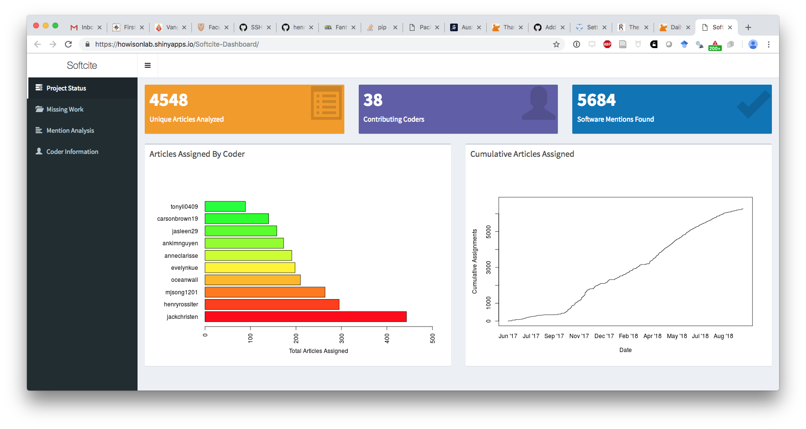
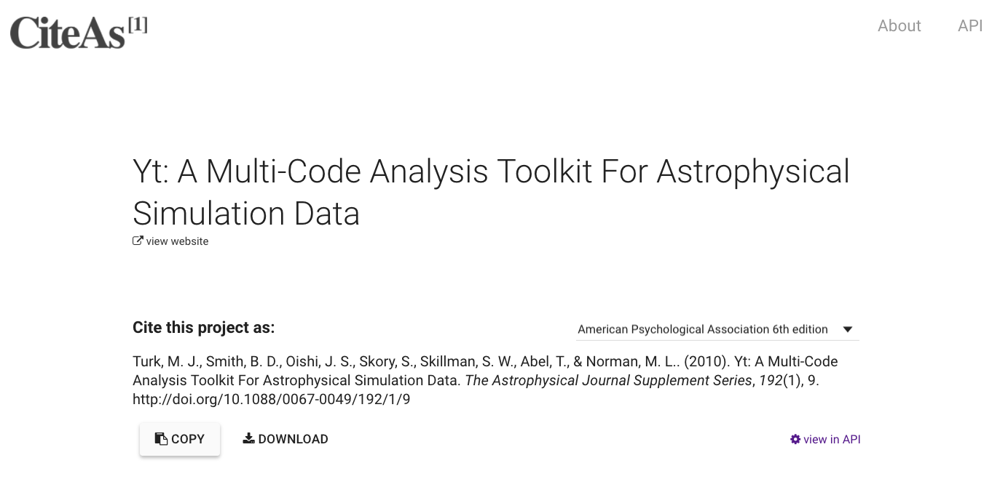
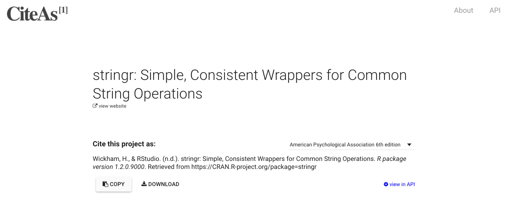
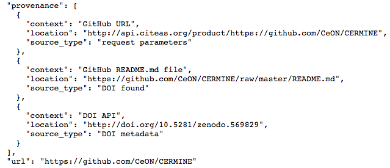
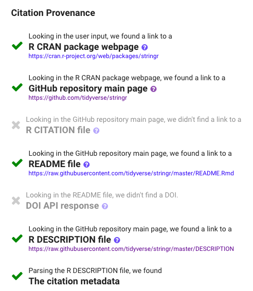

```{r, setup, include=FALSE, echo=F, results='hide', message=FALSE, warning=FALSE}
knitr::opts_chunk$set(cache=TRUE)
library(tidyverse)
library(data.world)
library(glue)
```


```{r, echo=F, results='hide', message=FALSE, warning=FALSE}

# Datasets are referenced by their URL or path
dataset_key <- "https://data.world/jameshowison/software-citations"
# List tables available for SQL queries
tables_qry <- data.world::qry_sql("SELECT * FROM Tables")
tables_df <- data.world::query(tables_qry, dataset = dataset_key)

prefixes <- "PREFIX bioj: <http://james.howison.name/ontologies/bio-journal-sample#>
PREFIX bioj-cited: <http://james.howison.name/ontologies/bio-journal-sample-citation#>
PREFIX ca: <http://floss.syr.edu/ontologies/2008/4/contentAnalysis.owl#>
PREFIX citec: <http://james.howison.name/ontologies/software-citation-coding#> 
PREFIX dc: <http://dublincore.org/documents/2012/06/14/dcmi-terms/>
PREFIX doap: <http://usefulinc.com/ns/doap#>
PREFIX owl: <http://www.w3.org/2002/07/owl#>
PREFIX rdf: <http://www.w3.org/1999/02/22-rdf-syntax-ns#>
PREFIX rdfs: <http://www.w3.org/2000/01/rdf-schema#>
PREFIX vivo: <http://vivoweb.org/ontology/core#>
PREFIX xml: <http://www.w3.org/XML/1998/namespace>
PREFIX xsd: <http://www.w3.org/2001/XMLSchema#>"

qry_string <-  "
SELECT ?article ?coder ?has_mentions 
WHERE {
	?article ca:isTargetOf [ ca:hasCoder ?coder ;
	                         ca:appliesCode [ rdf:type citec:coded_no_in_text_mentions ;
                                                citec:isPresent ?has_mentions ]
                            ]
                                                
}
"

qry <- data.world::qry_sparql(paste0(prefixes,qry_string))
results_df <- data.world::query(qry, dataset = dataset_key)

results_df <- results_df %>% mutate(has_mentions = ifelse(has_mentions == "true", T, F))

# unique articles
num_articles <- results_df %>% pull(article) %>% n_distinct()

# unique coders
num_coders <- results_df %>% pull(coder) %>% n_distinct()

# articles with and without mentions
with_mentions <- results_df %>% filter(has_mentions == T) %>% pull(article) %>% n_distinct()
no_mentions <- results_df %>% filter(has_mentions == F) %>% pull(article) %>% n_distinct()

```

```{r, echo=F, results='hide', message=FALSE, warning=FALSE}
qry_string = "SELECT ?article ?coder ?selection ?quote ?page ?software
WHERE {
	?article citec:has_in_text_mention ?selection .
	?selection citec:full_quote ?quote ;
	OPTIONAL { 
  ?selection citec:on_pdf_page ?page ;
	           ca:isTargetOf [ ca:hasCoder ?coder ;
	                           ca:appliesCode [ rdf:type citec:software_name ;
	                                            citec:isPresent true ;
	                                            rdfs:label ?software ]
	                          ]
	}
}"

qry <- data.world::qry_sparql(paste0(prefixes,qry_string))
results_df <- data.world::query(qry, dataset = dataset_key)

results_df <- results_df %>% 
  filter(!str_detect(article, "bio-journal"))

num_selections <- results_df %>% pull(selection) %>% n_distinct()


articles_in_count_order <- results_df %>%
  group_by(article) %>% 
  tally() %>% 
  arrange(desc(n)) %>%
  select(article) %>% 
  mutate(article_id = row_number())

# results_df %>% 
#   left_join(articles_in_count_order, by = "article") %>% 
#   ggplot(aes(x=article_id), color="blue") +
#   geom_histogram(stat="bin", binwidth = 1) +
#   xlab("article index") +
#   labs(title="Count of mentions per article")

```
```{r, echo=F, results='hide', message=FALSE, warning=FALSE}
# Software per article

results_df <- results_df %>%
  mutate(software_norm = str_to_lower(software))

unique_software <- results_df %>%
  pull(software_norm) %>%
  n_distinct()

software_ordered <- results_df %>%
  group_by(software_norm) %>% 
  tally() %>% 
  arrange(desc(n)) %>% 
  mutate(software_id = row_number())

# results_df %>% 
#   left_join(software_ordered, by = "software_norm") %>% 
#   ggplot(aes(x=software_id), color="blue") +
#   geom_histogram(stat="bin", binwidth = 1) +
#   xlab("software index") +
#   labs(title="Count of articles per software packages")

```

## SoftCite goals and activities

Our grant proposal lays out the goals of the SoftCite project:

> Our goal is to improve software in scholarship (science, engineering, and the humanities) by raising the visibility of software work as a contribution in the literature, thus improving incentives for software work in scholarship.

Our major activites are:

1. Develop a "Gold Standard" manually coded dataset of software mentions in the literature
2. Use that standard toward machine learning discovery of software mentions
3. Develop a database linking software tools to associated citations
4. Using this database, prototype and study three tools: CiteAs, CiteSuggest, and Software ImpactStory

In this report we describe Year 2 progress in each of these activities and discuss future plans.

## Progress on "Gold Standard" dataset development

This year we moved from our reported 151 articles in October 2017 to complete coding on 4,548 articles, moving from 523 mentions of software to 5,684 mentions. Our content analysis progress can be seen in this screenshot from our dashboard (developed by henryrossiter and mrcyndns, part of our undergraduate content analysis team). 




En route we have trained 37 content analysis research assistants, including undergraduates (from UT Austin and Houston Tillotson University), masters students from the Information School, and two female doctoral students (Hannah Cohoon and Caifan Du) who have managed the content analysis.

Our content analysis has been across three datasets: pubmed open access, economics (open access via unpaywall), and astronomy (open access via unpaywall). We were able to leverage the Impact Story work on unpaywall to create random samples of open access articles in econ and astro, once we recognized that unpaywall already included the sources we had identified in our proposal.  We considered that software was very unlikely to be mentioned in a systematically different way between closed and open-access published papers.

The dataset is publically available on [](https://github.com/howisonlab/softcite-dataset), including in a more accessible CSV format (the as-coded dataset is in RDF format).

# Machine Learning

software.science-miner.org

# CiteAs Update

CiteAs has been up and running throughout the year.  We have described the system in a very recent blog entry on [the URSSI blog](http://urssi.us/blog/2018/10/01/citeas.org-discovering-and-improving-software-requests-for-citation/) (included as an appendix to this report.)

We have also publicized CiteAs through data science oriented communities on twitter, as well as presenting it at the RSE conference in the UK (including a hackday), and the dot-Astronomy conference, both of which James Howison gave invited keynotes at.

We have been in discussions with program officers at the NIH who are interested in FIXME.

# Plans.

1. Sociotechnical study of CiteAs
    - User study
    - Interview potential users

2. Continued content analysis

As Patrice's work on the machine learning (described above) showed, there is an urgency to demonstrate improved agreement across the content analysis dataset.  We conducted a round of agreement early in Year 2 and demonstrated agreement on the most important codes at levels considered very good for social science content analysis (XXXX). Consultation with machine learning practicioners at the time suggested that improved training and then single coding would produce the best value for money, gaining more data overall.  With the further input of Patrice and the evidence from the current machine learning results, it now appears crucial to test and improve agreement across the dataset.  Accuracy issues can be particioned into three sources: agreement in the dataset, machine learning system issues, and data sufficiency issues. As we seek to understand and improve software entity recognition, and to gain the confidence of machine learning practicioners to have them attack the system issues creatively, demonstrating improved agreement and increasing the size of the dataset seem most crucial.

    - Improve agreement
    - Speedup via exploiting mention clustering
    - Test crowdsourcing?
    
    The first is bootstraping using a "whitelist" of software packages, identifying sentences with those words in them. We would then manually code just those sentences. Assuming that packages known beforehand (and therefore on the white list) are not mentioned in systematically different ways bootstraping can train a system to learn generally how packages are mentioned and apply that learning to find mentions of packages not on the whitelist. Colleagues have taken this approach [@pan_assessing_2015] but they have not had the fully manually coded set to validate their approach; our manually coded full dataset will provide validation.

The second approach takes advantage of one finding so far: software mentions cluster together in articles. However they do not cluster predictably (e.g., one paper might have multiple clusters and clusters are not neccessarily only in methods sections). We will experiment using a whitelist to locate mentions of known packages and then expand up and down 2 or 3 paragraphs to increase our chance of finding mentions of packages not on the whitelist; this ought to amerliorate bias resulting from the choice of the whitelist and allow us to more reliably characterize mentions per article en rouate to a full machine learning system.

3. Prototype Softcite Suggest
    - Good prototype publishers toolchain already chosen.

4. Drop Software Impact Story prototype, shift grant money back to Texas to improve content analysis dataset?
    - How many $$$?
    
Expenditure on hourly coding has come to \$70,000 of direct costs, for a dataset of 4,548 coded articles or a cost of just over \$15 per article. Hourly coders were paid \$15 an hour. While articles vary greatly in length, a mean rate of one article an hour seems about right, as fixed costs of infrastructure management and coder training are amortized.

While a prototype and sociotechnical study of Software Impact Story would be great, with the current performance of the machine learning system our underlying data would be limited to the manually coded data, reducing the usefulness of the prototype, even as a demonstration. The project team therefore believes the best course at this stage is to redirect funds intended for that development work to improvement and expansion of the content analysis work.


## Progress towards machine learning discovery of software mentions

The machine learning to automate recognition of software mentions builds on the dataset discussed above; only when it is large enough will we be able to begin training.  However, we have worked to ensure that the results of manual coding are most useful for machine learning training. Specifically we have experimented with approaches to converting the pdf articles to text in a way that we can label the sentences identified by the coders. As expected this is a difficult process (issues include headers and column conversion problems). We have two approaches to this. First we chose to work with the PubMed Open Access dataset which has clean XML encoded versions of each article, that decision will enable us to get started training without solving pdf conversion issues. Second Heather and Jason at ImpactStory have been exploring new generation pdf conversion tools, such as CERMINE [@noauthor_cermine_2017; @tkaczyk_cermine_2015], which identify elements such as headers, columns, tables etc. prior to text conversion.

## Progress towards CiteAs

The CiteAs tool, available at [citeas.org](http://citeas.org), allows users to map from software to ways to cite that software. The backend system provides an API (in preparation for future integration into other tools, both ours and others) integrated with the database described above. The web frontend uses the API to provide the current application. The open repository is available at https://github.com/Impactstory/citeas-api and [https://github.com/Impactstory/citeas-webapp](https://github.com/Impactstory/citeas-webapp). 
Users can provide the text name of a software package "yt", a URL such as a project landing page "yt-project.org" or "`https://cran.r-project.org/web/packages/stringr`" or a DOI (publication or software), such as "10.5281/zenodo.160400". The system then checks the database and if no entry is found kicks off a procedure to locate an appropriate citation. Potential sources are checked in sequence and those results returned to users with a provenance chain which helps users known where the suggestions come from and will help software projects adjust how they request citations.

As an example Figure 1 shows a screenshot showing the results of querying "yt-project". In the background the system has downloaded the page and parsed it for a citation request. In the case of `yt` the citation request on the yt-project homepage links to a bibtex file which was then downloaded and parsed to provide the citation.

{width=85%}

Figure 2 shows an example of a user seeking a citation for an R package. The system downloads the URL `https://cran.r-project.org/web/packages/stringr` and identifies a link to a repository (here the repository is github). We then seek a file in the repository that makes a citation request, checking README and the DESCRIPTION file on CRAN (in the future we will also check for a CITATION or CITATION.TXT in the repository). The citation below is built from the DESCRIPTION file.

{width=85%}

The provenance chain is illustrated in the API output in Figure 3, which shows the locations and techniques that CiteAs attempted in finding a citation. In this case the system identified DOIs located in the README file; the DOIs relate to both an article and to a zenodo archived version of the software. These DOIs are each are mapped to a citation and a prefered citation displayed to the user.

{width=85%}

We are exposing these citations alternatives in the interface, shown below in Figure 4, in reference the the stringr package.

{height=3in}

## Progress towards database linking software tools to associated citations

The backend for CiteAs consults what will become the database linking tools to associated citations. Thus far the database is built from the techniques that CiteAs uses to locate citation requests. 

Over time we will expand this database in two ways. First we will run our citation lcoation techniques pre-emptively using catalogues of scientific software (e.g., libraries.io, NSF and NIH listings, and field specific listings such as the ASCL and SBGrid). Second, we will add tool-to-citation links from the literature including initially those identified through our manual coding, and eventually those identified as our machine learning improves.  As links are added to the database they will become available to CiteAs and our two other tools (CiteSuggest and Software ImpactStory).

## Our collaboration is working well

We are working well as a group. We have scheduled calls each second week to report progress and provide input to each other's activities. Between these calls we have regular email contact and watch each others software repositories. Jason and Heather remotely attended one of James and Hannah's student coding sessions to motivate the students by explaining the end-use of the dataset and demonstrating the CiteAs tool. We distributed CiteAs stickers to the students.

We may seek to arrange face-to-face working sessions, co-located with conferences we would naturally attend (such as the 2018 RDA or FORCE11 Scholarly Communications conference) but we do not see the need to spend funds on separate face to face meetings.

We hope to expand our collaboration beyond our funded group. As mentioned above we are collecting software mention coding from others and working to make it compatible with our schema to publish them together. We are also in communication with [libraries.io](http://libraries.io) which will form a natural extension, allowing the joining of their dependency information with our citation information, per software package.

## Plans for next year

Our priorities for work in the immediate future are:

1. Expand and accelerate our gold-standard dataset production at UT Austin.
2. Soft-launch CiteAs.org and monitor feedback and iterate the tool
3. Prototype machine learning using the gold-standard dataset
4. Drawing on the database and API created for CiteAs and machine learning results as they become available we will develop CiteSuggest, then develop Software ImpactStory.

5. James at UT Austin will recruit an additional doctoral student to undertake socio-technical studies of the three tools.

While the grant was for 2 years, we have adjusted our budgeting to anticipate completing the work over three years, so that we can gather sufficient coded articles and implement the machine learning. ImpactStory plans to implement initial versions of the prototypes and work on the machine learning but then slow their pace of work until a large enough "gold standard" collection has been completed.

# References

